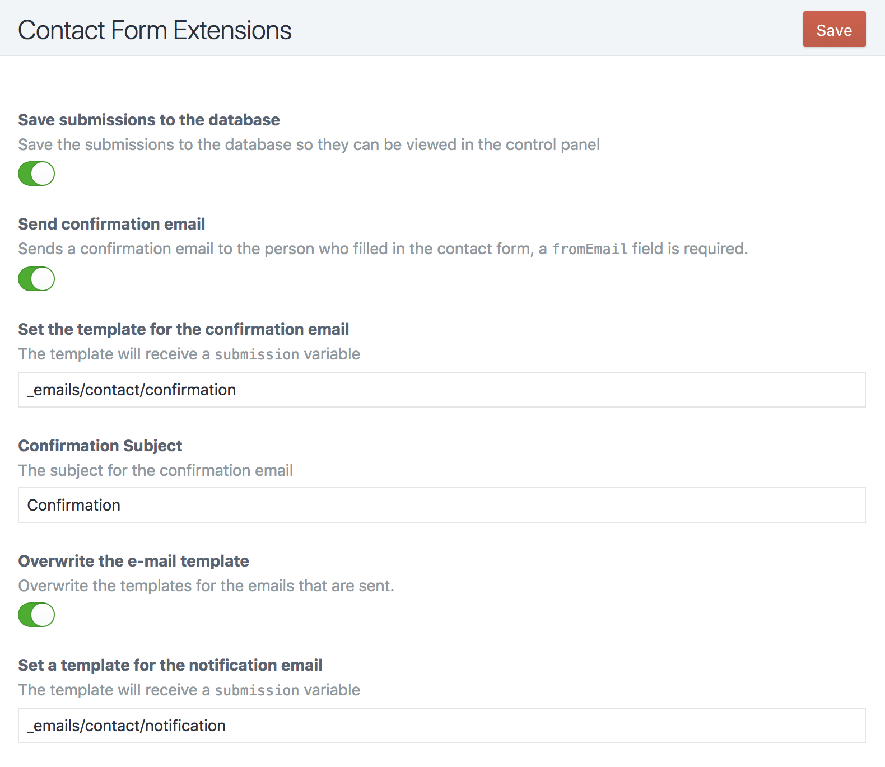
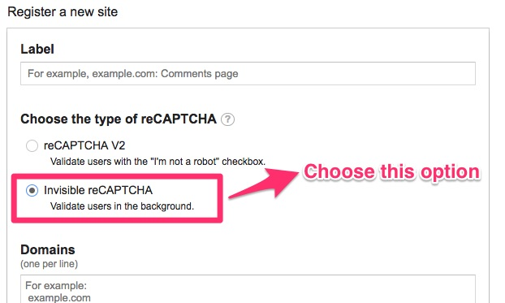

# Craft Contact Form Extensions


[](https://github.com/hybridinteractive/craft-contact-form-extensions/releases)
[](https://packagist.org/packages/hybridinteractive/craft-contact-form-extensions)

Adds extensions to the Craft CMS contact form plugin.

- Save submissions to the database and view them in the Control Panel
- Add a confirmation email that is sent to the submitting email
- Overwrite the default e-mail template
- Add an invisible reCAPTCHA



## Support Open Source

This plugin is licensed under a MIT license, which means that it's completely free open source software, and you can use it for whatever and however you wish.

## Requirements

This plugin requires Craft CMS 4 and the [Contact Form](https://github.com/craftcms/contact-form) plugin.

## Installation

Install this plugin through the Plugin Store or follow these instructions.

1. Open your terminal and go to your Craft project:

        cd /path/to/project

2. Then tell Composer to load the plugin:

        composer require hybridinteractive/craft-contact-form-extensions

3. In the Control Panel, go to Settings → Plugins and click the “Install” button for Craft Contact Form Extensions.

## Overwriting the email templates

When you overwrite the email templates, your twig view will receive a `submission` variable which contains all the information that a default Contact Form submission contains:

- fromName
- fromEmail
- subject
- message
- attachment

Note: All of the overrides will use the message as an array and therefore if you want a message field it would be `name=message[message]`. If a `name=message` is used it will wipe out the array of overrides.

## Overriding the form name

When saving submissions to the database the default form name will be "Contact". If you add a `message[formName]` hidden field you can override the form name. This can also used to create multiple form indexes in the Control Panel.

```html
<input type="hidden" name="message[formName]" value="myFormName">
```

## Overriding the confirmation template

When sending confirmation option is enabled and custom templates per form are needed, override the template with a hidden field. The template needs to be placed under templates\\_emails folder. Add a hash for safety. The same data is passed as in the default overridden template.

```html
<input type="hidden" name="message[confirmationTemplate]" value="{{ 'contact'|hash }}">
```

## Overriding the confirmation subject

When sending confirmation option is enabled and custom subjects per form are needed, override the subject with a hidden field. Add a hash for safety.

```html
<input type="hidden" name="message[confirmationSubject]" value="{{ 'confirmationSubject'|hash }}">
```

## Overriding the notification template

When sending notification option is enabled and custom templates per form are needed, override the template with a hidden field. The template needs to be placed under templates\\_emails folder. Add a hash for safety. The same data is passed as in the default overridden template.

```html
<input type="hidden" name="message[notificationTemplate]" value="{{ 'contact'|hash }}">
```

## Overriding where the message is sent

```html
<input type="hidden" name="message[toEmail]" value="{{ 'hello@rias.be'|hash }}">
```

## Disable recaptcha on a per form basis

```html
<input type="hidden" name="message[disableRecaptcha]" value="true">
```

## Disable saving to database on a per form basis

```html
<input type="hidden" name="message[disableSaveSubmission]" value="true">
```

## Disable confirmation email on a per form basis

```html
<input type="hidden" name="message[disableConfirmation]" value="true">
```

## Adding invisible reCAPTCHA

Before you set your config, remember to choose `invisible reCAPTCHA` while applying for keys.



Enable reCAPTCHA in the Contact Form Extensions settings and fill in your `siteKey` and `secretKey`.

Then use the following code in your forms inside of the `<form>` element:

```twig
{{ craft.contactFormExtensions.recaptcha | raw }}
```

### ReCaptcha V3

To use ReCaptcha V3, choose the V3 option in the settings, make sure to enter a correct `siteKey` and `secretKey` and enter a `threshold`. [Learn more about ReCaptcha V3](https://developers.google.com/recaptcha/docs/v3)

Then include the following code in your forms inside of the `<form>` element, for example for the `homepage` action (actions help separate out reCaptcha submissions within the reCaptcha console):

```twig
{{ craft.contactFormExtensions.recaptcha('homepage') | raw }}
```

## Display form submissions in your template files

```twig

   {{ submission.dateCreated|date('d-m-Y H:i') }} - {{ submission.fromEmail }} - {{ submission.fromName }}

```

Brought to you by [Hybrid Interactive](https://hybridinteractive.io/)
